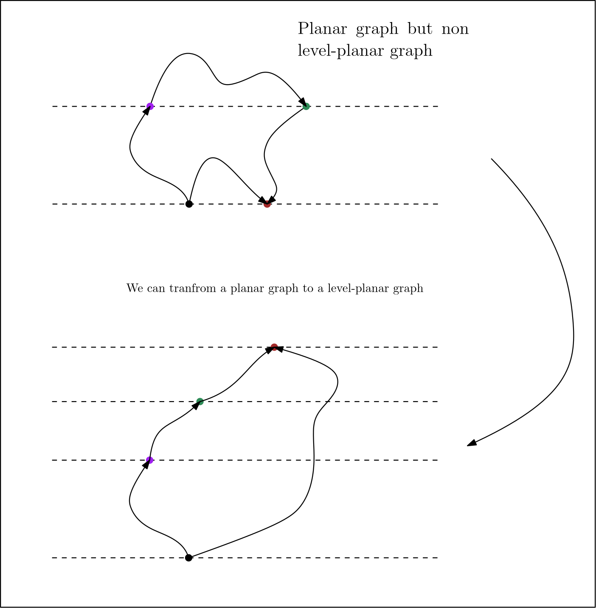

the problem consists of determining the linear ordering of the vertices on the same level of the [[Level graph]] so the correspending edges don't intersect between the levels, if such an embedding exists.

The problem is formulated in terms of [[CNF]]-formulas. The [[Planarity of a graph|planarity]] test essentially [[Reduction|reduces]] to testing [[Satisfiability|satisfiability]] of 2[[CNF]]-formula [[Randerath et al. , A satisfiability formulation of Problems on Level Graphs|1]]. 

A [[Planarity of a graph |planarity]] does not imply [[Level Planarity|level planarity]]. This example show case it: 

## The [[CNF]]-Formulation of the problem
We consider in a proper [[Level graph|level]]-[[DAG]] with two subsequent levels and let 
$e = xu$ and $f = yv$ be two arcs (directed edges), the arcs $e$ and $f$ don't cross with the regards to the embedding iff $\left(x < y \leftrightarrow u < v\right)$ .

> [!remark] 
> two arcs with the same sink or tail do never intersect 

Identifying pairs of different nodes from the same level as boolean variables, e.g $uv$ is 
a boolean variable with $uv = \mathrm{true}$ iff $u < v$. For short $h(e)$ and $t(el)$ denote the head and the tail of the edge $e$ respectively. 

We know that $X\leftrightarrow Y = \bar{X}Y \vee X\bar{Y}$ 
Let $C(G)$ be the [[CNF]]-forumla with the following conditions: 
- f(i) or every two arcs $e$ and $f$ between two subsequent levels from the expression (2-[[CNF]]) $$h(e)h(f) \leftrightarrow t(e)t(f)$$
- for all boolean variables $uv$ form the clause (also 2-[[CNF]]) $$uv \leftrightarrow \bar{vu}$$
- (for cycle removal on a single level) (it looks like 3-[[Satisfiability|SAT]] to me it was mentioned as [[Horn-clauses]] of length 3 in [[Randerath et al. , A satisfiability formulation of Problems on Level Graphs|1]])$$\left( uv \wedge vw\right) \rightarrow uw$$
(i) forces $C(G)$ to have $\mathcal{O}(n^2)$ boolean variables as each boolean variable represent an edge and for a graph it's of order of $n^2$. for each $e \in E(G)$ there are $\mathcal{O}(n)$ instance of the expression (i) meaning $\mathcal{O}(n^2)$ instance of (i) for the graph $G$ and since $$
\newcommand{\overbar}[1]{\mkern 1.5mu\overline{\mkern-1.5mu#1\mkern-1.5mu}\mkern 1.5mu}

h(e)h(f)\leftrightarrow t(e)t(f) \Leftrightarrow \overbar{h(e)h(f)} \,\, t(e)t(f) \vee h(e)h(f) \,\, \overbar{t(e)t(f)}$$
each instruction (i) is composed of 2 clauses so (i) forces $\mathcal{O}(n^4)$ clauses. 
