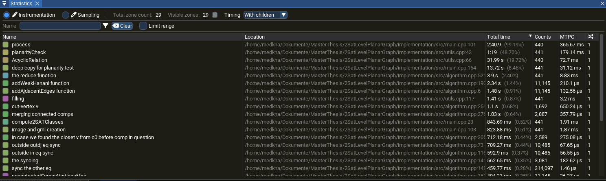

# Spike in execution time 
there is spike in execution time for proper level graph with small number of levels but relatively larger number of vertices 

the spike is fixed, it was probably some deep copy that I didn't intend to do somewhere. I refactored somethings and the runetime became 'stable' in lower levels.  

# The special case of a connected components encapsulated in an other
My algorithm fails for now in the special case described in the title, ( i didn't implement it yet, wasn't sure if it was needed ), this example is a proof that it 
is needed 

You can also find the graph in gml format in `specialEncapsulation/randomProperLevelGraph_v_13_l_4.svg`

# Profiling to improve time execution 
I found out there are some functions that i forgot to move some args with big types by ref. 

Also I found a function call that involves an overhead after. It's after calling the reduction function, I 
still can't figure out what's the issue.  
the source code is basically the bloc calling the function, so it's just some overhead that I can't explain yet. 

I am still in debug mode, it could be the reason behind it. I can't switch to release mode, as i get some assertion problems that I can't debug yet.

## UPDATE
I just didn't put the Zone marker for the profiling in the beginning of the function. Basically the deep copy of the equivalence class before starting my 
algorithm is the one responsible for the overhead. this deep copy is needed for the planarity test, therfore we can associate this overhead with the planarity test. 

# More profiling after altering the addWeakHananiTutteCase 
I had to alter the function to include the case where one connected component is encapsulated by another. Still in progress, but it added some execution time 
for my algorithm. I fixed some instructions that take more time for no purpose to the algorithm. Basically I made less lookups to maps, compared the sharedpointers 
before merging to equivalence classes, and not synchronzing the equivalence class of the pairs in the equivalence class that is being treated if it didn't change.

All of this small changes helped fastening the execution significally    
Let's put the focus on the `reduce function` in blue, it takes 2.40 % of the execution time compared to the calculation of the 2-SAt equivalence classes that only 
takes 0.64% of the total execution time. I need to still be careful, is it a linear difference or asymptotic difference, is it also a difference due to bad implementation ? 

# Wrong Implementation of the weak hanani-tute encapsulation case: 

Now, we are checking the neighboring vertices $N_G'(v)$ to the new added cutvertex $v$. The cutvertex merge the set 
of connected components $\mathcal{C}$, we check there order from the equivalence classes that we have so far.

We order the connected components based on the minimum level that the connected component exist in $\min_{w\in C_i}{l\left(w\right)}$.

We take the first component as the 'base' graph. Then we add the closest component in the order and merge both components becoming the 
new 'base' graph. 

for each connected component $C'$ beside the first in the order $\mathcal{C_1}$ (the one used in the 'base' graph), we look for the nearest vertex $u$ in the $N_G'(v)$ 
and in $\mathcal{C_1}$. We just copy the relations of the vertices $w\in \mathcal{C_1}$ with $ l(w) = l(u)$ and $w != u$

The issue with this is that the equivalence class doesn't have a vision that can extend all the elements of the connected component $C_1$ in 
the zone from $l(u)$ to $h(C')_min = \min_{z\in C'}{l\left(z\right)}$. The best would be to do the same procedure but from the level $h(C')_min$.  

With that I fixed the random graph that failed to give us just equivalence classes that do not generate cyclic order between some vertices of the same level. 

UPDATE: I implemented the special case of the weak hanani-tutte encapsulation with this idea and I found an issue with this reasoning.  

# Not complete propagation of the equivalence class merge the weak hanani-tutte case for a vertex that doesn't have an incoming edge and also is not in the max of min levels between the two merged componenets: 

There are some vertices that are not taking in consideration when doing the 'synchronization' between two connected components. 
I show this illustration to showcase the problem 

So now the task is to find a way to take in consideration also these vertices $v$ that are don't have a path $P$ to a vertex in $h(C')_min$ if we consider paths that only 
have endpoints between $h(C')_min$ and $l(v)$.

# Space bottleneck
## std::map not getting freed back to the os 
I am generating mutliple random planar graphs, executing the algorithm and testing it on one graph at a time, the issue is that the space reserved during the 
execution of graph eventho it is freed in the execution (when I profile with valgrind, it doesn't show that I consume that much memory), it is not freed back to 
the os. Tried couple things, I also tried boost `flat_map` which helped but stil i have the same issue. 
At the end, I got out to testing of instances from the cpp project and implemented it in a bash script, this way, we test one graph 
per execution of the cpp project and the resources go back to the os. 
## Can't test huge test graph due to memory consumption for the testing of the correcteness of the output of algorithm
Now I can test more cases, but I can't test with number of vertices more than 350 vertices and level less or equal to 10 (on 6 gb ram space). The 
less levels we have, the more edges we can have and also the bigger the set of possible truth assignement of the equivalence classes, so 
the map that stores all the possible assignement gets really big. 
