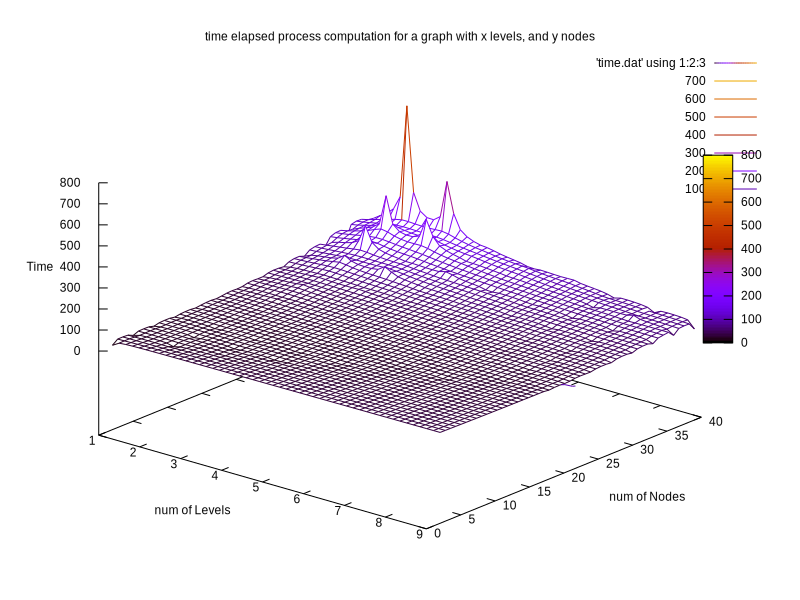
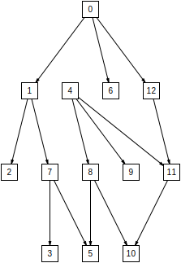
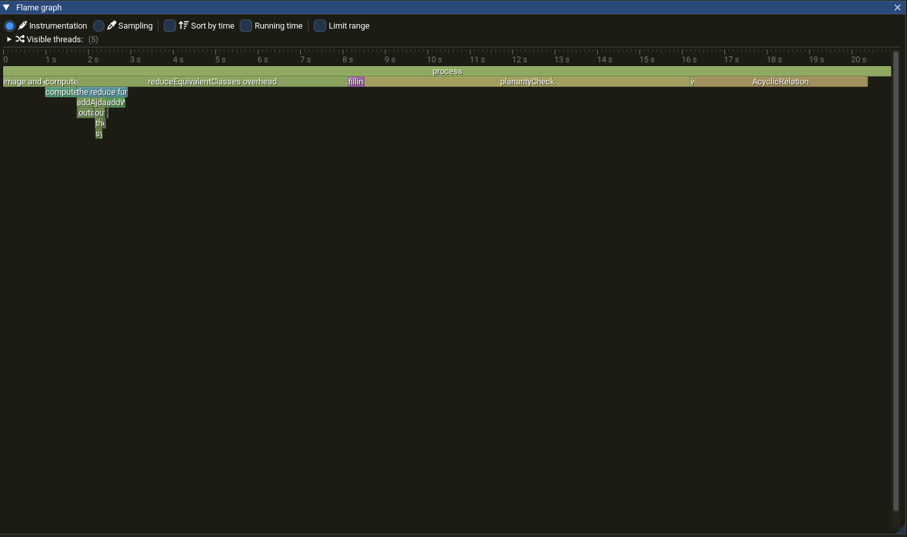
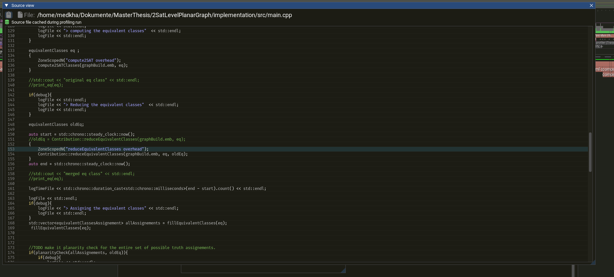
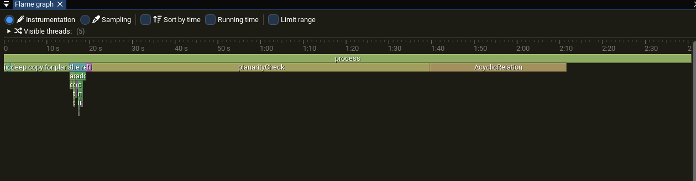

# Spike in execution time 
there is spike in execution time for proper level graph with small number of levels but relatively larger number of vertices 

the spike is fixed, it was probably some deep copy that I didn't intend to do somewhere. I refactored somethings and the runetime became 'stable' in lower levels.  

# The special case of a connected components encapsulated in an other
My algorithm fails for now in the special case described in the title, ( i didn't implement it yet, wasn't sure if it was needed ), this example is a proof that it 
is needed 

You can also find the graph in gml format in `specialEncapsulation/randomProperLevelGraph_v_13_l_4.svg`

# Profiling to improve time execution 
I found out there are some functions that i forgot to move some args with big types by ref. 

Also I found a function call that involves an overhead after. It's after calling the reduction function, I 
still can't figure out what's the issue.  
the source code is basically the bloc calling the function, so it's just some overhead that I can't explain yet. 

I am still in debug mode, it could be the reason behind it. I can't switch to release mode, as i get some assertion problems that I can't debug yet.

## UPDATE
I just didn't put the Zone marker for the profiling in the beginning of the function. Basically the deep copy of the equivalence class before starting my 
algorithm is the one responsible for the overhead. this deep copy is needed for the planarity test, therfore we can associate this overhead with the planarity test. 

# More profiling after altering the addWeakHananiTutteCase 
I had to alter the function to include the case where one connected component is encapsulated by another. Still in progress, but it added some execution time 
for my algorithm. I fixed some instructions that take more time for no purpose to the algorithm. Basically I made less lookups to maps, compared the sharedpointers 
before merging to equivalence classes, and not synchronzing the equivalence class of the pairs in the equivalence class that is being treated if it didn't change.

All of this small changes helped fastening the execution significally    
Let's put the focus on the `reduce function` in blue, it takes 2.40 % of the execution time compared to the calculation of the 2-SAt equivalence classes that only 
takes 0.64% of the total execution time. I need to still be careful, is it a linear difference or asymptotic difference, is it also a difference due to bad implementation ? 

